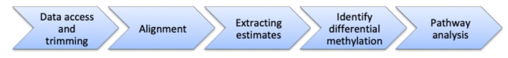
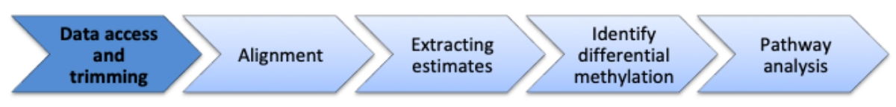
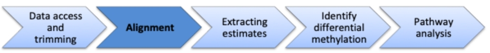
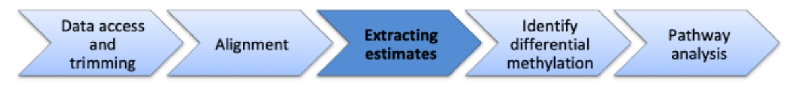
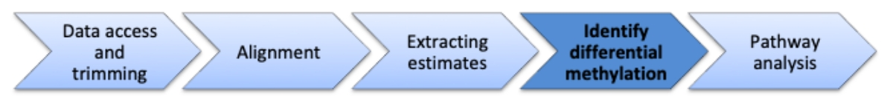
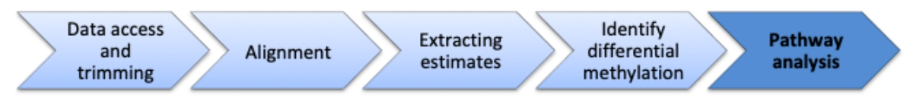
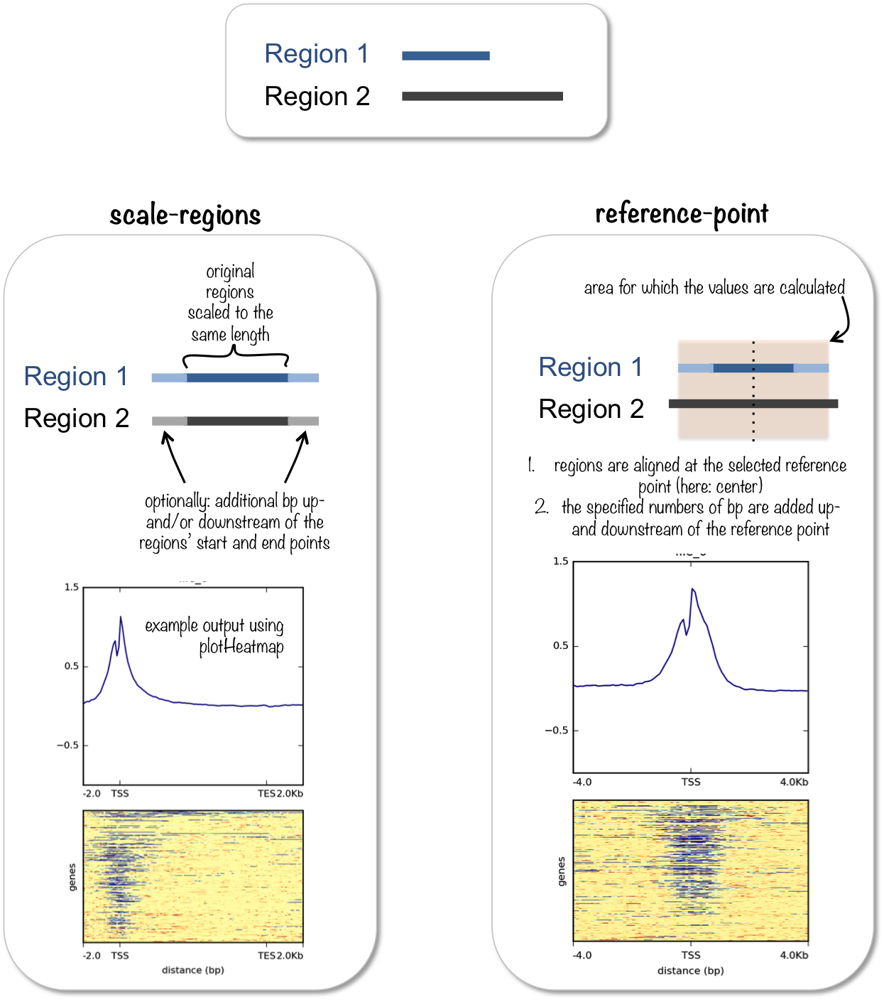

<style type="text/css">
.small {
  font-size: 65%;
}

code.r{
  font-size=8px;
}

code.python{
  font-size=3px;
}


code.bash{
  font-size=8px;
}
.medium {
  font-size: 80%;
}

.smallcode {
  font-size:50%
}
.smallcode .remark-code {
  font-size: 50%
}

</style>

```{r setup, include=FALSE}
knitr::opts_chunk$set(echo = TRUE)
```
## Outline

* Introduction to WGBS

--

* Introduction to submitting jobs in batch on Slurm

--

* Reviewing epigenomics

--

* Methylome workshop

---
## Whole-genome bisulfite sequencing (WGBS)

* How WGBS is different than other types of DNA sequencing?

--

* What are the pros of WGBS?

--

* What are the cons of WGBS?

--

* What type of information can you get from WGBS?

---
## Excercise

What do you think is the order of the following statements?

* Aligning with bwa-meth

* Copy fastq files from a shared folder

* Download the reference genome

* Extracting CpG methylation estimates

* Identifying differentially methylated regions

* Index the reference genome

* Investigating genes affected by differential methylation

* Trimming fastq files with trim galore

* Visualizing methylation at CpG islands

---
## Introduction to high performance computing

Handling genomic datasets requires:

* Secure and efficient data storage

* Computational power for parallel processing and analysis

* Efficient use of hardware by people with access to the datasets

* How do you think a high performance computing server, such as SciNet teaching cluster, varies from your laptop?

---
## How can we run a program on the cluster?

* Request an interactive session

```{bash eval=FALSE}
salloc
samtools ...
```

--

* Write a bash script and submit using _sbatch_

```{bash eval=FALSE}
echo -e '#!/bin/sh' > myBashScriptThatIWillSubmitToRunOnSlurm.sh
echo "samtools ..." >> myBashScriptThatIWillSubmitToRunOnSlurm.sh
sbatch -c 1 --mem=4G -t 1:00:00 myBashScriptThatIWillSubmitToRunOnSlurm.sh
```

--

* Assignment: write a bash script that for 100 times, will print your name and submit it to the Slurm cluster using _sbatch_

---
## For loops in bash

```{bash eval=FALSE}
for i in {0..99}
do
  echo "Variable i is set to $i"
done
```

---
## What is epigenomics?

* All the cells in our body have the same genetic code, but they use it differently

--

* Epigenomics is the science of assessing cell type specific changes to DNA using high-throughut methods 

--

  + Chromatin accessibility: ATAC-seq

--

  + Histone modifications: ChIP-seq

--

  + Transcription factor binding: ChIP-seq

--

  + Short and long range DNA interactions: Chromatin capture, HiC, Hi-ChIP, etc.

--

  + Chemical modifications of nucleotides: Methylation arrays, MeDIP-seq, and bisulfite sequencing

---
## Bisulfite sequencing pipeline

```{r echo=FALSE, eval=TRUE, out.height = "400px", message=FALSE}
require(DiagrammeR)
grViz("
digraph boxes_and_circles {

  # a 'graph' statement
  graph [overlap = true, fontsize = 10]

  # several 'node' statements
  node [shape = box,
        fontname = Helvetica]
  FASTQT; FASTQN; BAMT; BAMN; bedGraphT; bedGraphN; DMRs

  node [shape = circle,
        fixedsize = false,
        width = 1] // sets as circles
  BWAMETH; MethylDackel; Metilene;

  # several 'edge' statements
  FASTQT->BWAMETH BWAMETH->BAMT
  FASTQN->BWAMETH BWAMETH->BAMN
  BAMT->MethylDackel BAMN->MethylDackel
  MethylDackel->bedGraphT MethylDackel->bedGraphN
  bedGraphT->Metilene bedGraphN->Metilene
  Metilene->DMRs
}
")
```
---

## Question

* Which important steps are missing here?

```{r echo=FALSE, eval=TRUE, out.height = "400px", message=FALSE}
require(DiagrammeR)
grViz("
digraph boxes_and_circles {

  # a 'graph' statement
  graph [overlap = true, fontsize = 10]

  # several 'node' statements
  node [shape = box,
        fontname = Helvetica]
  FASTQT; FASTQN; BAMT; BAMN; bedGraphT; bedGraphN; DMRs

  node [shape = circle,
        fixedsize = false,
        width = 1] // sets as circles
  BWAMETH; MethylDackel; Metilene;

  # several 'edge' statements
  FASTQT->BWAMETH BWAMETH->BAMT
  FASTQN->BWAMETH BWAMETH->BAMN
  BAMT->MethylDackel BAMN->MethylDackel
  MethylDackel->bedGraphT MethylDackel->bedGraphN
  bedGraphT->Metilene bedGraphN->Metilene
  Metilene->DMRs
}
")
```
---
## Quality control

* Each step of the process requires a quality control

--

* "FASTQC" to assess quality of FASTQ files before and after removing the adapters

--

* "samtools flagstat" to assess the percent of uniquely aligned reads

--

* Enrichment of differentially methylated regions in promoters, CpG islands, etc.


---

* Outline

  + Download the reference genome
  
  + Index the reference genome

  + Copy fastq files from a shared folder
  
  + Trimming fastq files with trim galore
  
  + Aligning with bwa-meth (copy the BAM files from a shared folder)
  
  + Extracting CpG methylation estimates

  + Visualizing methylation at CpG islands (supplementary slides)
  
  + Identifying differentially methylated regions
  
  + Investigating genes affected by differential methylation

```{r, out.width = "800px", echo=FALSE}

```

---
## Troubleshooting guide

Throughout this tutorial, you may see that you do not see the same output as the instructor.

Feel free to ask for help.

Some common reasons include:

* You are not logged into the teaching cluster. 

  * You can type `echo $HOSTNAME` to see if it returns `teach01.scinet.local` or not

* Your session got disconnected and the environmental variables that you defined in the earlier steps are not initialized. 

  * You can check if a variable is initialized by typing `echo $VARIABLENAME`. In the case of arrays, to see their elements, you can type `echo ${ARRAYNAME[@]}`.

  * If these are not initialized, nothing will be printed and that means you need to go back to the first occurence of the variable or array and re-run the command.

---
## Indexing BWA-meth

* Download FASTA file of chr22

```{bash eval=FALSE}
mkdir -p $SCRATCH/Ref
cd $SCRATCH/Ref
wget ftp://ftp.ensembl.org/pub/release-96/fasta/homo_sapiens/dna/Homo_sapiens.GRCh38.dna.chromosome.22.fa.gz
zcat Homo_sapiens.GRCh38.dna.chromosome.22.fa.gz | sed 's/>22/>chr22/' > Homo_sapiens.GRCh38.dna.chromosome.22.fa
```

* Index FASTA file
```{bash eval=FALSE}
salloc
module load anaconda3 gcc java fastqc cutadapt trimgalore bwa samtools bwameth htslib methyldackel
bwameth.py index Homo_sapiens.GRCh38.dna.chromosome.22.fa
```

* Expected run time is 3 minutes

```{r, out.width = "800px", echo=FALSE}

```

---
## Download CpG islands

* Visit http://genome.ucsc.edu

* Select the 3rd tool, _Table Browser_ 

* Select the correct genome assembly, and group _Regulation_

* Select the _CpG Islands_ track

* Under position, type chr22

* Select the output format as _BED - browser extensible data_

* Save the file as: _hg38CpgIslandsForChr22.bed_

* Use scp to transfer the file to $SCRATCH/Datasets

```{bash eval=FALSE}
# From the local computer
scp ~/Downloads/hg38CpgIslandsForChr22.bed username@teach.scinet.utoronto.ca:/scratch/t/teachmmg3003/mmg3003ta002/Datasets
```

```{r, out.width = "800px", echo=FALSE}

```

---
## Downloading necessary files

* The following directory contains all of the pipeline for chromosome 22:

```{bash eval=FALSE}
/scratch/m/mhoffman/karimzad
```

* You can copy the fastq files from that directory to your scratch folder:

```{bash eval=FALSE}
cp -rf /scratch/m/mhoffman/karimzad/newFastqFilesChr22 $SCRATCH
```

* This folder contains all of the files from the pipeline we process.
You can copy them the same way if you have issues running the commands.

```{r, out.width = "800px", echo=FALSE}

```


---
## What are these samples

* H1-hESC is a human embryonic stem cell line which has been profiled extensively by the ENCODE consortium

* The left ventricle embryonic tissue is obtained from a human embryo

* By comparing these two tissues, we _may_ identify which regions of chr22 must be (de)methylated for differentiating the embryonic stem cell towards a heart muscle progeny.


---
## Trim the FASTQ files

* Write a script to trim paired-end FASTQ files with trim galore in a new folder called trimmedFastqs

```{bash eval=FALSE}
LOGDIR=$SCRATCH/Logs # Creates a new variable 
SCRIPTDIR=$SCRATCH/Scripts # For scripts that run different programs
mkdir -p $SCRIPTDIR $LOGDIR # Creating multiple folders simultaneously
cd $SCRIPTDIR # Change diretory
FASTQDIR=$SCRATCH/newFastqFilesChr22 # PAth to our untrimmed fastq files
FQFOLDERS=($(ls $FASTQDIR)) # Arrays
OUTMAIN=$SCRATCH/trimmedFastqsChr22
for FQFOLDER in ${FQFOLDERS[@]}
do
  FQ1=$FASTQDIR/$FQFOLDER/$FQFOLDER\__1.fastq.gz
  FQ2=$FASTQDIR/$FQFOLDER/$FQFOLDER\__2.fastq.gz
  OUTDIR=$OUTMAIN/$FQFOLDER
  mkdir -p $OUTDIR
  echo -e '#!/bin/sh' > $SCRATCH/Scripts/$FQFOLDER\_TrimGalore.sh
  echo "module load anaconda3 gcc java fastqc cutadapt trimgalore bwa samtools bwameth htslib methyldackel" >> $SCRATCH/Scripts/$FQFOLDER\_TrimGalore.sh
  echo "trim_galore --fastqc --paired --gzip -o $OUTDIR $FQ1 $FQ2" >> $SCRATCH/Scripts/$FQFOLDER\_TrimGalore.sh
  sbatch -c 1 -t 1:00:00 -e $LOGDIR/$FQFOLDER\_TrimGalore.%A.ERR -o  $LOGDIR/$FQFOLDER\_TrimGalore.%A.LOG $SCRIPTDIR/$FQFOLDER\_TrimGalore.sh
done
```

```{r, out.width = "800px", echo=FALSE}

```

---
## FASTQC reports

* Use _scp_ to download fastqc files to your local computer

```{bash eval=FALSE}
STUDENTID=05
scp -r mmg3003student$STUDENTID@teach.scinet.utoronto.ca:/scratch/t/teachmmg3003/mmg3003student$STUDENTID/trimmedFastqsChr22/*/*fastqc* ~/Downloads
```


```{r, out.width = "800px", echo=FALSE}

```

---
## Align with BWA-Meth

* Write a script to generate <filename>_Align.sh scripts for aligning fastq files and submit them to cluster with sbatch

```{bash eval=FALSE}
cd $SCRIPTDIR
REF=$SCRATCH/Ref/Homo_sapiens.GRCh38.dna.chromosome.22.fa
FASTQDIR=$SCRATCH/trimmedFastqsChr22
BAMDIR=$SCRATCH/trimmedAlignedBamsChr22
mkdir -p $BAMDIR
mkdir -p $SCRIPTDIR
SAMPLES=($(ls $FASTQDIR))
for SAMPLE in ${SAMPLES[@]}
do
  FQ1=$(ls $FASTQDIR/$SAMPLE | grep val_1.fq.gz)
  FQ2=$(ls $FASTQDIR/$SAMPLE | grep val_2.fq.gz)
  echo -e '#!/bin/sh' > $SCRIPTDIR/$SAMPLE\_Align.sh
  echo "module load anaconda3 gcc java fastqc cutadapt trimgalore bwa samtools bwameth htslib methyldackel" >> $SCRIPTDIR/$SAMPLE\_Align.sh
  echo "bwameth.py --reference $REF $FASTQDIR/$SAMPLE/$FQ1 $FASTQDIR/$SAMPLE/$FQ2 | samtools view -bS -F 4 > $BAMDIR/$SAMPLE.bam" >> $SCRIPTDIR/$SAMPLE\_Align.sh
  # sbatch -c 1 -t 4:00:00 -e $LOGDIR/$SAMPLE\_Align.%A.ERR -o $LOGDIR/$SAMPLE\_Align.%A.LOG $SCRIPTDIR/$SAMPLE\_Align.sh
done
```

```{r, out.width = "800px", echo=FALSE}

```

---
## Copy the aligned bam files

* It takes 4 hours of CPU time to align the FASTQ files to chr22.

* Assignment: Similar to FASTQ files, copy the folder containing bam files of chr22 to your _$SCRATCH_ NOW!

```{r, out.width = "800px", echo=FALSE}

```

---
## In-class assignment

* Match the following phrases to either of Methylation array, whole genome bisulfite sequencing, or ChIP-seq

  + Alignment
  
  + Bisulfite treatment
  
  + Mutations modifying the epigenome
  
  + EWAS
  
  + Fluorescence imaging
  
  + Anti-body cross-reactivity
  
  + Sex-specific batch effects
  
  + Sensitive to $O_3$ levels

---
## Sort and index bam files

* MethylDackel requires sorted and indexed bam files

* Write a script to sort and index each bam file

```{bash eval=FALSE}
cd $SCRIPTDIR
BAMDIR=$SCRATCH/trimmedAlignedBamsChr22
BAMFILES=($(ls $BAMDIR | grep .bam | grep -v bam.bai | grep -v sorted))
for BAMFILE in ${BAMFILES[@]}
do
  SAMPLENAME=$(echo $BAMFILE | sed 's/.bam//')
  echo -e '#!/bin/sh' > $SCRATCH/Scripts/$SAMPLENAME\_sortAndIndex.sh
  echo "module load anaconda3 gcc java fastqc cutadapt trimgalore bwa samtools bwameth htslib methyldackel" >> $SCRATCH/Scripts/$SAMPLENAME\_sortAndIndex.sh
  echo "samtools sort $BAMDIR/$BAMFILE -o $BAMDIR/$SAMPLENAME\_sorted.bam" >> $SCRATCH/Scripts/$SAMPLENAME\_sortAndIndex.sh
  echo "samtools index $BAMDIR/$SAMPLENAME\_sorted.bam" >> $SCRATCH/Scripts/$SAMPLENAME\_sortAndIndex.sh
  sbatch -c 1 -t 1:00:00 -e $LOGDIR/sortIndex.%A.ERR -o $LOGDIR/sortIndex.%A.LOG $SCRATCH/Scripts/$SAMPLENAME\_sortAndIndex.sh
done
```

```{r, out.width = "800px", echo=FALSE}

```

---
## Run MethylDackel

* MethylDackel uses BAM files to extract cytosine methylation counts

* Run a script to run MethylDackel files for each BAM file

```{bash eval=FALSE}
cd $SCRIPTDIR
BAMDIR=$SCRATCH/trimmedAlignedBamsChr22
OUTMAIN=$SCRATCH/methylDackelOutputChr22
BAMFILES=($(ls $BAMDIR | grep sorted | grep -v bai | grep bam))
REF=$SCRATCH/Ref/Homo_sapiens.GRCh38.dna.chromosome.22.fa
for BAMFILE in ${BAMFILES[@]}
do
  SAMPLENAME=$(echo $BAMFILE | sed 's/_sorted.bam//')
  OUTDIR=$OUTMAIN/$SAMPLENAME
  mkdir -p $OUTDIR
  echo -e '#!/bin/sh' > $SCRIPTDIR/MethylDackel_$SAMPLENAME.sh
  echo "module load anaconda3 gcc java fastqc cutadapt trimgalore bwa samtools bwameth htslib methyldackel" >> $SCRIPTDIR/MethylDackel_$SAMPLENAME.sh
  echo "MethylDackel extract --fraction --mergeContext $REF $BAMDIR/$BAMFILE -o $OUTDIR/$SAMPLENAME\_" >> $SCRIPTDIR/MethylDackel_$SAMPLENAME.sh
  sbatch -c 1 -t 1:00:00 -e $LOGDIR/Meth.%A.ERR -o $LOGDIR/Meth.%A.LOG $SCRIPTDIR/MethylDackel_$SAMPLENAME.sh
done
```

```{r, out.width = "800px", echo=FALSE}

```

---
## Explore the output of MethylDackel

* What does each column of MethylDackel output represent?

```{r eval=FALSE}
track type="bedGraph" description="/scratch/t/teachmmg3003/mmg3003ta002/methylDackelOutput/H1-hESC_rep1/H1-hESC_rep1_ CpG methylation levels"
22      10513864        10513865        0
22      10513906        10513907        1
22      10515169        10515170        0
```

```{r, out.width = "800px", echo=FALSE}

```

---
## bedGraph is not efficient

* bedGraph is a user-readable file format

* Storing genomic signal in bedGraph format takes too much space and is computationally inefficient for random data retrieval

* bigWig format, however, can store and retrieve genomic signals efficiently

* Here we will download a program called bedGraphToBigWig and use it to convert bedGraph files


```{bash eval=FALSE}
mkdir -p ~/software/bin
cd ~/software/bin
wget http://hgdownload.soe.ucsc.edu/admin/exe/linux.x86_64/bedGraphToBigWig
# Give yourself permission to run this program
chmod u+x bedGraphToBigWig
```

```{r, out.width = "800px", echo=FALSE}

```

---
## Finding size of chromosomes

* bedGraphToBigWig requires a file with information of how long each chromosome is

```{bash eval=FALSE}
cd ~/software/bin
wget http://hgdownload.soe.ucsc.edu/admin/exe/linux.x86_64/fetchChromSizes
chmod u+x fetchChromSizes
./fetchChromSizes hg38 > $SCRATCH/Ref/hg38.chromsizes
```

* How else can we extract chromosome sizes from a fasta file?

```{r, out.width = "800px", echo=FALSE}

```

---
## Convert bedGraph to bigWig

* Write a script to convert output of MethylDackel from bedGraph to bigWig

```{bash eval=FALSE}
salloc
MAINDIR=$SCRATCH/methylDackelOutputChr22
SAMPLES=($(ls $MAINDIR))
for SAMPLE in ${SAMPLES[@]}
do
  BDG=$(ls $MAINDIR/$SAMPLE | grep bedGraph)
  BW=$(echo $BDG | sed 's/bedGraph/bigWig/')
  ~/software/bin/bedGraphToBigWig $MAINDIR/$SAMPLE/$BDG $SCRATCH/Ref/hg38.chromsizes $MAINDIR/$SAMPLE/$BW
done
```

```{r, out.width = "800px", echo=FALSE}

```


---
## Identify differentially methylated regions

* There are various software for identifying differentially methylated regions

* Here we will use [https://dx.doi.org/10.1101%2Fgr.196394.115](Metilene: fast and sensitive calling of differentially methylated regions from bisulfite sequencing data)

* Metilene requires a union file of bedGraphs we generated earlier with MethylDackel with the following columns:

```{r eval=FALSE}
Chrom  Start  End  G1_1  G1_2  G2_1  G2_2
```

---
* We can generate the input file this way:


```{bash eval=FALSE}
MAINDIR=$SCRATCH/methylDackelOutputChr22
SAMPLES=($(ls $MAINDIR))
BGS=()
HEADER=(chr start end)
for SAMPLE in ${SAMPLES[@]}
do
  HEADER+=($SAMPLE)
  BG=$(ls $MAINDIR/$SAMPLE | grep bedGraph)
  BGS+=($MAINDIR/$SAMPLE/$BG)
done
module load gcc/7.3.0 bedtools
echo -e ${HEADER[@]} | tr " " "\t" > $SCRATCH/methylDackelOutputChr22/mergedOutputs_unionbedg.bed
bedtools unionbedg -i ${BGS[@]} >> $SCRATCH/methylDackelOutputChr22/mergedOutputs_unionbedg.bed
```

```{r, out.width = "800px", echo=FALSE}

```

---
## Metilene

```{bash eval=FALSE}
module load metilene
OUTDIR=$SCRATCH/metileneOutputChr22
mkdir -p $OUTDIR
echo -e "Chrom\tStart\tEnd\tqVal\tmeanDiff\tnumCpgs\tpMWU\tp2DKS\tmeanG1\tmeanG2" > $OUTDIR/MetileneDMR.bed
metilene -a "H1-hESC" -b "leftVentricle" $SCRATCH/methylDackelOutputChr22/mergedOutputs_unionbedg.bed >> $OUTDIR/MetileneDMR.bed
```

```{r, out.width = "800px", echo=FALSE}

```


---
## Exploring DMRs in the genome browser

```{r, out.width = "800px", echo=FALSE}

```

---
## In-class assignment - open question

* A recent study used DNA methylation arrays to compare white blood cells in 2,312 healthy individuals and 1,322 individuals with alzheimer's disease. They identified 5 methylation probes at the vicinity of NFE2 transcription factor with increased methylation in most Alzheimer's disease patients.

* What do you think are the key points to investigate before conclusing these methylation probes as biomarkers of alzheimer's disease?

---
## Assignment

* In 200 words, describe how Metilene works

* For each of the following, choose the best format (BED, bedGraph, bigWig)

  + Reporting list of differentially methylated regions to a collaborator
  
  + Hosting a genome-wide signal track for chromatin accessibility
  
  + Reporting state of methylation for all CpGs in a single differentially methylated region to a collaborator
  

Continues on next slide:
  
---
## Assignment
  
* Repeat the same analysis for chr21. 

  + Provide an annotated script which explains how you accomplished each of the steps. 
  
  + List statistically significant differentially methylated regions
  
  + Which genes are likely to be affected by these changes in DNA methylation?


* Choose one of the following methods (ATAC-seq, ChIP-seq, or Hi-C) and describe how the method is performed experimentally (200 words limit).

---
# Supplementary slides

---
## How can we explore hundreds of genomic regions for specific features, enrichments, etc.?

* DeepTools has a program called _computeMatrix_

* computeMatrix accepts signal files (e.g. in bigWig) and genomic region annotations (e.g. in BED or GTF) to calculate summary statistics

* computeMatrix has two modules:

  + reference-point: Obtains measures for entries of BED file (as reference) as well as their upstream and downstream
  
  + scale-regions: Calculates summary measures for BED files by shrinking each entry to a user-defined length

---

```{r, out.width = "800px", echo=FALSE}

```

```{r, out.width = "800px", echo=FALSE}

```

---
## How is methylation signal around CpG islands?

* Write a script to execute computeMatrix reference-point on CpG island BED file and the four bigWig files

```{bash eval=FALSE}
MAINDIR=$SCRATCH/methylDackelOutputChr22
SAMPLES=($(ls $MAINDIR))
BWS=()
for SAMPLE in ${SAMPLES[@]}
do
  BW=$(ls $MAINDIR/$SAMPLE | grep bigWig)
  BWS+=($MAINDIR/$SAMPLE/$BW)
done
module load anaconda2/5.1.0 deeptools/3.2.1-anaconda2
OUTDIR=$SCRATCH/methylationMatricesChr22
mkdir -p $OUTDIR
computeMatrix reference-point -R $SCRATCH/Datasets/hg38CpgIslandsForChr22.bed -S ${BWS[@]} -o $OUTDIR/mergedMethylationAroundIslands.tsv.gz --referencePoint TES --skipZeros --sortRegions descend --sortUsingSamples 1
plotProfile -m $OUTDIR/mergedMethylationAroundIslands.tsv.gz -out $OUTDIR/mergedMethylationAroundIslands_1.pdf 
plotProfile -m $OUTDIR/mergedMethylationAroundIslands.tsv.gz --perGroup --plotType heatmap -out $OUTDIR/mergedMethylationAroundIslands_2.pdf 
```

```{r, out.width = "800px", echo=FALSE}

```
---
