<style type="text/css">
.small {
  font-size: 65%;
}

code.r{
  font-size=8px;
}

code.python{
  font-size=3px;
}


code.bash{
  font-size=8px;
}
.medium {
  font-size: 80%;
}

.smallcode {
  font-size:50%
}
.smallcode .remark-code {
  font-size: 50%
}

</style>

```{r setup, include=FALSE}
knitr::opts_chunk$set(echo = TRUE)
```


## RNA-seq

### What's unique about RNA-seq?
--

* Slightly different alignment problem

--

* We also care about quantification

--

* We want to discover novel splicing or chimeric genes

--

* We want to distinguish forward and reverse strand signals for overlapping genes

---
## RNA-seq

### What can we do with RNA-seq?

--

* Quantify gene expression
--

* Identify novel and common splice variations
--

* Identify allele-specific expression
--

* Identify alternative poly-adenylation
--

* Identify circular RNA variations
--

* Identify copy number variation
--

* Identify gene fusions and viral integration sites
--

* ..

---
## Isoform analysis


```{r, out.width = "600px", echo=FALSE}
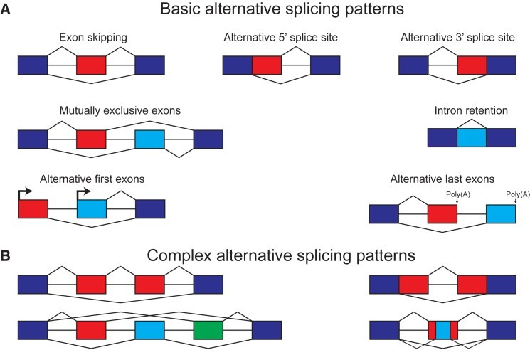
```

Park, Eddie, et al. "The expanding landscape of alternative splicing variation in human populations." *The American Journal of Human Genetics* 102.1 (2018): 11-26.

---
## Potential effect of polymorphisms

* Genome wide association studies (GWAS) investigate effect of a polymorphism on a quantitative trait or disease

--

* expression quantitative trait loci (eQTL) studies investigate polymorphisms resulting in a change in expression of a gene

--

* splicing quantitative trait loci (sQTL) studies invesigate polymorphisms resulting in a change in splicing of a gene


---
## Example of sQTL

```{r, out.width = "400px", echo=FALSE, eval=FALSE}
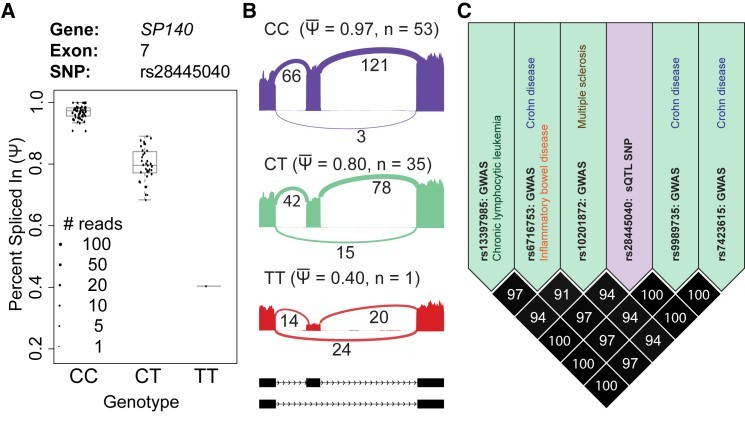
```


Park, Eddie, et al. "The expanding landscape of alternative splicing variation in human populations." *The American Journal of Human Genetics* 102.1 (2018): 11-26.

---
## Alternative splicing in rare disease

* Many examples of highly penetrant alternative splicing are known.
--

  * Exon 3 skipping in MIP results in an autosomal dominant congenital cataract (Zeng et al. 2013)
--

  * Type I Neurofibromatosis due to exon skipping in NF1 gene (Fang et al. 2001)
--

  * Ehlers-Danlos syndrome due to exon skipping in COL5A2 (Symoens et al. 2011) 
--

  * Cystic fibrosis due to cryptic exon inclusion in CFTR (Sanz et al. 2017)
--


Anna A, Monika G. Splicing mutations in human genetic disorders: examples, detection, and confirmation. *J Appl Genet*. 2018;59(3):253-268. 

---
## Isoform analysis

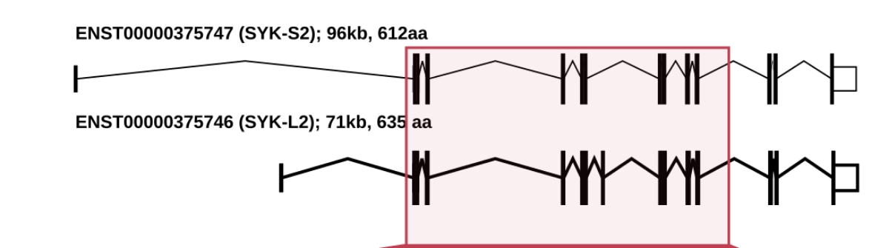

From Karimzadeh et al. 2018 *Oncotarget*

---
## Isoform analysis

* Does it matter which isoform is expressed?

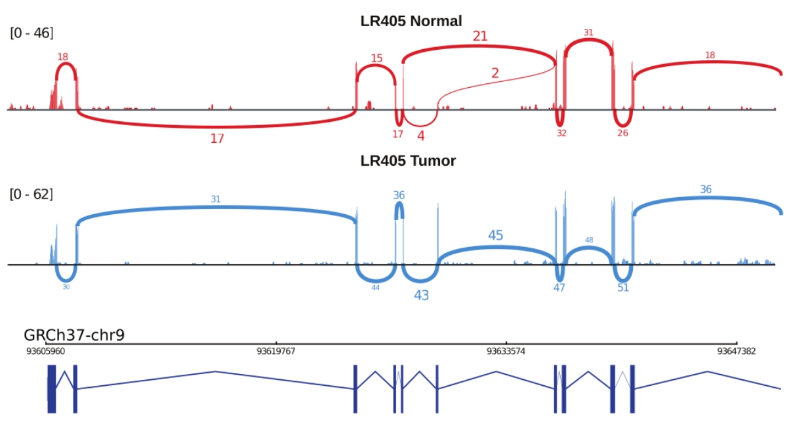

From Karimzadeh et al. 2018 *Oncotarget*


---
#### File formats

* GTF or general transfer format is a tab separated table with 9 columns which encode genomic information

  * seqname: First column has name of the chromosome or scaffold
  * source: name of the program generating the file or the database
  * feature: type of genomic information such as gene, exon, transcript, genomic variation, etc.
  * start
  * end
  * score
  * strand
  * frame: One of 0, 1, or 2 indicating if the information is for a particular base of a codon (when encoding genomic variation)
  * attribute: A semicolon-separated list of tag-value pairs

```{r eval=FALSE}
1 transcribed_unprocessed_pseudogene  gene        11869 14409 . + . gene_id "ENSG00000223972"; gene_name "DDX11L1"; gene_source "havana"; gene_biotype "transcribed_unprocessed_pseudogene"; 
1 processed_transcript                transcript  11869 14409 . + . gene_id "ENSG00000223972"; transcript_id "ENST00000456328"; gene_name "DDX11L1"; gene_sourc e "havana"; gene_biotype "transcribed_unprocessed_pseudogene"; transcript_name "DDX11L1-002"; transcript_source "havana";
```

* GTF often has track lines, specifying information of a group of features

```{r eval=FALSE}
chr1 assembly chromosome 1 14972282 . + . Sequence chr1
```


---
### GFF (Version 3)

* GFF is a GTF with a different format of the 9th column (attribute)

```{r eval=FALSE}
ctg123 . mRNA            1300  9000  .  +  .  ID=mrna0001;Name=sonichedgehog
ctg123 . exon            1300  1500  .  +  .  Parent=mrna0001
ctg123 . exon            1050  1500  .  +  .  Parent=mrna0001
ctg123 . exon            3000  3902  .  +  .  Parent=mrna0001
```

* GFF version 2 is actually very similar to GTF (aka GFF v 2.5)

* There are publicly available scripts for converting between these formats

* Most software either require GTF or GFF3

---
## Isoform analysis of RNA-seq data

### Software: Cufflinks


* _De novo_ annotation of transcripts

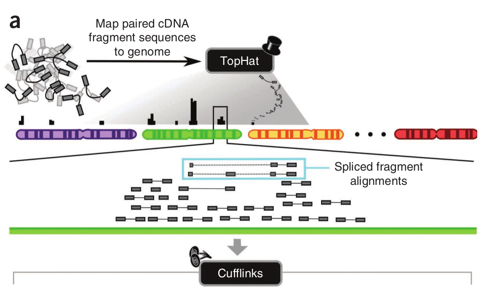
---
### Cufflinks

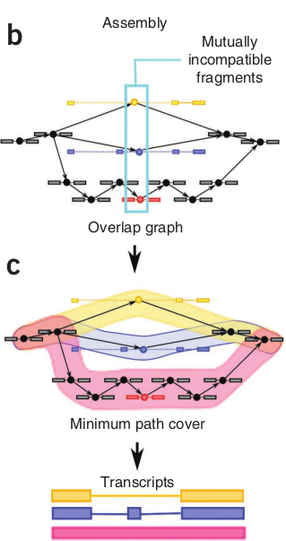

---
### Cufflinks

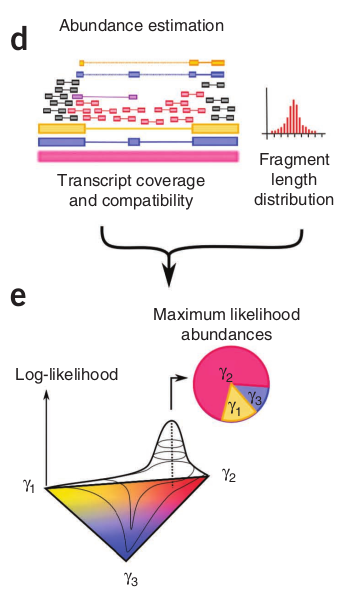

---
### Cufflinks

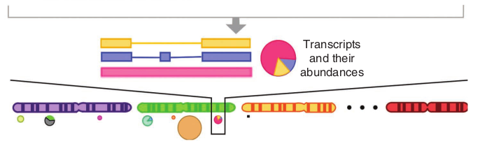

---
## Isoform analysis of RNA-seq data

### Software: MISO


Katz, Yarden, et al. "Analysis and design of RNA sequencing experiments for identifying isoform regulation." *Nature Methods* 7.12 (2010): 1009.

--
* Mixture of isoforms (MISO) using Bayesian inference

--

* Calculates the Percentage Spliced In (PSI or $\Psi$) reads for each transcript or splice junction

--

* Rescales $\Psi$ based on library size and number of mapped reads

--

* Generates Sashimi plots

--

* Can perform a comparison of two conditions, but cannot account for covariates or multiple comparisons

--

* Does not model biological variability

---
### MISO algorithm

```{r, out.height = "500px", echo=FALSE}
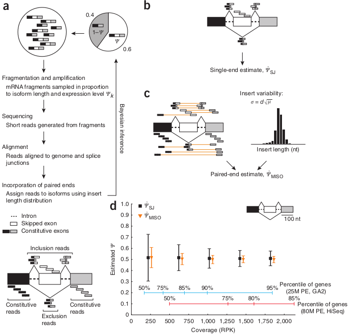
```

---
### Sashimi plots

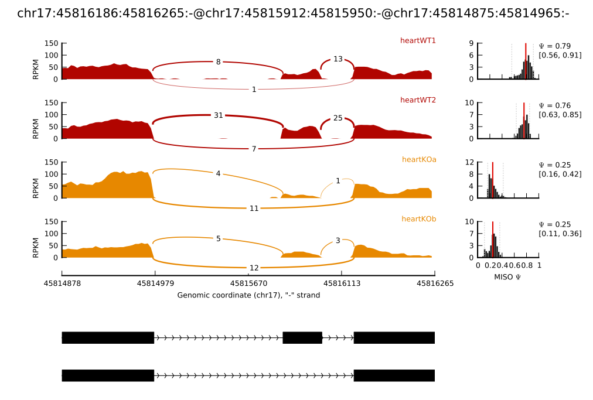
---
### Example of a MISO pipeline

```{r echo=FALSE, eval=TRUE, out.height = "600px", message=FALSE}
require(DiagrammeR)
grViz("
digraph boxes_and_circles {

  # a 'graph' statement
  graph [overlap = true, fontsize = 10]

  # several 'node' statements
  node [shape = box,
        fontname = Helvetica]
  FASTQT; FASTQN; GFF; BAMT; BAMN; MISOT; MISON; DifferentialIsoforms

  node [shape = circle,
        fixedsize = false,
        width = 1] // sets as circles
  STAR; MISORUN; MISOCOMPARE;

  # several 'edge' statements
  FASTQT->STAR STAR->BAMT
  FASTQN->STAR STAR->BAMN
  GFF->MISORUN BAMT->MISORUN BAMN->MISORUN
  MISORUN->MISOT MISORUN->MISON
  MISOT->MISOCOMPARE MISON->MISOCOMPARE
  MISOCOMPARE->DifferentialIsoforms
}
")
```


---
### Software: DEXSeq

Anders, Simon, Alejandro Reyes, and Wolfgang Huber. "Detecting differential usage of exons from RNA-seq data." *Genome Research* 22.10 (2012): 2008-2017.


--
Fits one model per gene (similar to DESeq), with two additional parameters:

--
* One with dimension $l$ accounting for the fraction of reads mapping to $l$ different bins

--
* One additional parameter of $l$ dimensions accounting for the effect of condition on fraction of reads in each bin

---

### DEXSeq plot

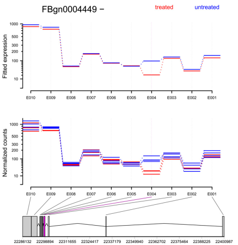

---
## DEXseq pipeline
```{r echo=FALSE, eval=TRUE, out.height = "600px", message=FALSE}
require(DiagrammeR)
grViz("
digraph boxes_and_circles {

  # a 'graph' statement
  graph [overlap = true, fontsize = 10]

  # several 'node' statements
  node [shape = box,
        fontname = Helvetica]
  FASTQT; FASTQN; GFF; BAMT; BAMN; ExonCountsT; ExonCountsN; DifferentialIsoforms

  node [shape = circle,
        fixedsize = false,
        width = 1] // sets as circles
  STAR; HTSeq; DEXSeq;

  # several 'edge' statements
  FASTQT->STAR STAR->BAMT
  FASTQN->STAR STAR->BAMN
  GFF->HTSeq
  GFF->DEXSeq BAMT->HTSeq BAMN->HTSeq
  HTSeq->ExonCountsT HTSeq->ExonCountsN
  ExonCountsT->DEXSeq ExonCountsN->DEXSeq
  DEXSeq->DifferentialIsoforms
}
")
```
---
## What is the advantage of each tool?

```{r echo=FALSE, message=FALSE}
require(knitr)
require(kableExtra)
summary_df = read.csv("comparison.tsv", header=T, sep="\t", check.names=FALSE)
kable(summary_df) %>% kable_styling(bootstrap_options = "striped", full_width = F, position = "float_left", font_size = 9)
```

---
### Tutorial

--

Main task: Identify differentially expressed isoforms between breast tumour and normal lymphoblastoid controls

--

* Make MISO index

--

* Identify differential isoforms in MISO

--

* Make Sashimi plots

--

* Use HTSeq to obtain table of counts for DEXseq

--

* Run DEXseq and visualize the results

--

* Compare the results from MISO and DEXSeq

---
## Indexing MISO

Task: Index the chromosome 22 with a proper GFF file

* Make a directory in your scratch called isoformAnalysis
```{bash eval=FALSE}
mkdir $SCRATCH/isoformAnalysis
cd $SCRATCH/isoformAnalysis
```

* Under isoformAnalysis, make *datasets* and download chr22 GFF file there

```{bash eval=FALSE}
# Type your commands here
# Make the directory
# Change your current directory to the directory you made
# Download this file to the directory you made: ftp://ftp.ensembl.org/pub/release-95/gff3/homo_sapiens/Homo_sapiens.GRCh38.95.chromosome.22.gff3.gz
```

* The assmebly you are using uses *chr22* and not *22*. Change that in the gff file without compressing the output (MISO requires uncompressed gff). Hint: use a program called *sed*
```{bash eval=FALSE}
# In sed, you can replace all occurences of a search (x) with any character (y): cat myfile | sed 's/x/y/g'
# Hint: zcat <filename> | sed 's/<ReplaceThis>/<WithThis>/g' > Homo_sapiens.hg38.95.chromosome.22.gff3
```
---
### Indexing MISO

* Use index_gff in MISO binary folder and index the GFF under isoformAnalysis/datasets/misoIndex
```{bash eval=FALSE}
# MISOBIN=/scinet/teach/software/2018a/opt/base/miso/0.5.4/bin
# export PATH="$MISOBIN":$PATH
module load anaconda2 miso
# Hint: index_gff --help
```

---
## Run MISO -- individual files

* Run MISO individually for each of the sorted bam files.
  * You can use for loops to repeat the same instructions for several files

* Save the output to isoformAnalysis/misoRuns in your scratch directory

```{bash eval=FALSE}
MISOINDEX=$SCRATCH/isoformAnalysis/datasets/misoIndex
BAMDIR=/scratch/j/johanna/johanna/ISOFORM_TUTORIAL/BAMS
BAMFILES=($(ls $BAMDIR | grep .bam | grep -v bam.bai))
OUTMAIN=$SCRATCH/isoformAnalysis/misoRuns
mkdir $OUTMAIN
for BAMFILE in ${BAMFILES[@]}
do
  # Using sed to remove extension for creating the output folder
  SAMPLENAME=$(echo $BAMFILE | sed 's/.bam//')
  # Create the environmental variable OUTDIR for saving miso output to
  OUTDIR=$OUTMAIN/$SAMPLENAME
  # Create the folder with the value saved into environmental variable $OUTDIR
  mkdir -p $OUTDIR
  # Print to the screen which bam file is currently being used
  echo "Running MISO for $BAMFILE"
  # Run miso
  miso --run $MISOINDEX $BAMDIR/$BAMFILE --output-dir $OUTDIR/ --read-len 150
  # Print summary to the screen
  echo "Summarizing MISO for $BAMFILE"
  # Run MISO summary
  summarize_miso --summarize-samples $OUTDIR $OUTDIR
done
```

---
## Run MISO -- comparison mode

* Compare the first biological replicate of breast cancer with the first biological replicate of lymphoblastoid cells in MISO comparison mode

```{bash eval=FALSE}
# Hint: compare_miso --help
```
---
### Select top hits from MISO comparison mode

* Open the miso_bf file in R

* Add a new column which has the most extreme value in the bayes_factor column

* Add a new column which has the most extreme value in the diff column

```{r eval=FALSE}
miso_df = read.csv(
  "hcc1395_tumor_rep1_sorted_vs_hcc1395_normal_rep1_sorted.miso_bf", header=T, sep="\t")
miso_df$MostExtremeBF = sapply(as.character(miso_df$bayes_factor), function(x){
  # split the values in x which are comma separated and save it to bayes_factors
  return(max(bayes_factors))
})
miso_df$MostExtremeDiff = sapply(as.character(miso_df$diff), function(x){
  # split the values in x which are comma separated ant save it to psis
  return(max(abs(psis)))
})
```

---
## Visualize results with MISO Sashimi script

MISO requires a setting file for making a sashimi plot.
The setting file requires to know:

* Width, height, font size, resolution, color, etc.

* Path to each BAM file

* Coverage of each bam file

* Full path to each bam file

* Name to use for each bam file

---
```{python eval=FALSE}
[data]
bam_prefix = /scratch/t/teachmmg3003/mmg3003ta002/BAMS
miso_prefix = /scratch/t/teachmmg3003/mmg3003ta002/isoformAnalysis/misoRuns
bam_files = ["hcc1395_tumor_rep1_sorted.bam", "hcc1395_normal_rep1_sorted.bam"]
miso_files = ["hcc1395_tumor_rep1_sorted", "hcc1395_normal_rep1_sorted"]
[plotting]
fig_width = 10
fig_height = 8
intron_scale = 50
exon_scale = 4
logged = True
font_size = 6.5
bar_posteriors = True
ymax = 150
nyticks = 3
nxticks = 4
show_ylabel = True
show_xlabel = True
show_posteriors = True
resolution = 0.5
posterior_bins = 40
gene_posterior_ratio = 5
colors = ["#FE9A2E", "#08088A"]
coverages = [100000, 110000]
bar_color = "b"
bf_thresholds = [0, 1, 2, 5, 10, 20]
```
---
### Sashimi plot with MISO

```{bash eval=FALSE}
SETTINGFILE=$SCRATCH/isoformAnalysis/miso_setting.txt
OUTDIR=$SCRATCH/isoformAnalysis/sashimiPlots
sashimi_plot --plot-event "gene:ENSG00000197077" $MISOINDEX $SETTINGFILE --output-dir $OUTDIR
```

---
## Prepare the GFF file for DEXseq

Download the GRCh38 GTF file from Ensembl, filter for chr22, and convert it to a specific gff using DEXSeq-accompanied python script *dexseq_prepare_annotation.py*

```{bash eval=FALSE}
cd $SCRATCH/isoformAnalysis/datasets
wget ftp://ftp.ensembl.org/pub/release-95/gtf/homo_sapiens/Homo_sapiens.GRCh38.95.gtf.gz
zcat Homo_sapiens.GRCh38.95.gtf.gz | sed 's/^/chr/g' | fgrep chr22 > chr22_Homo_sapiens.GRCh38.95.gtf

DEXSEQSCRIPTS=~/software/DEXSeq/python_scripts
python $DEXSEQSCRIPTS/dexseq_prepare_annotation.py chr22_Homo_sapiens.GRCh38.95.gtf chr22_Homo_sapiens.GRCh38.95.gff
```

---
## Use HTSeq to obtain read counts for each exon

DEXSeq has a python script which uses HTSeq for obtaining read counts for each exon.
It requies read-group sorted BAM files.

```{bash eval=FALSE}
GFF=$SCRATCH/datasets/chr22_Homo_sapiens.GRCh38.95.gff
BAMDIR=$SCRATCH/BAMS
BAMFILES=($(ls $BAMDIR | grep .bam | grep -v bam.bai))
OUTMAIN=$SCRATCH/isoformAnalysis/DexSeqCounts
mkdir $OUTMAIN
## Complete the script below
## Hint: python $DEXSEQSCRIPTS/dexseq_count.py --help
for BAMFILE in ${BAMFILES[@]}
do
  echo "Running MISO for $BAMFILE"
  ## python $DEXSEQSCRIPTS/dexseq_count.py ...
done
```

---
## Identify genes with different transcripts using DEXseq

In R, load the files and identify genes with differential isoforms.

```{r eval=FALSE}
options(stringsAsFactors=FALSE)
require(DEXSeq)

## Set input/output information
scratch_dir = Sys.getenv("SCRATCH")
gffPath = file.path(scratch_dir, "datasets", "chr22_Homo_sapiens.GRCh38.95.gff")
outDir = file.path(scratch_dir, "isoformAnalysis", "dexSeqOutput")
dir.create(outDir)
countDir = file.path(scratch_dir, "isoformAnalysis", "DexSeqCounts")

## Get full path of count.tsv files
conditions = character()
countFiles = dir(countDir)[grep("DexSeqCount.tsv", dir(countDir))]
for(countFile in countFiles){
  name_parts = unlist(strsplit(countFile, "_", T))
  conditions = c(conditions, name_parts[2])
}
```
---
## Run DEXSeq commands

DEXSeq needs to know the full path to each of the DEXSeq count file, and how to treat them in a statistical model.
The statistical model of DEXSeq can handle is a generalized linear model and can handle any type of comparison a GLM can.

```{r eval=FALSE}
sampleTable = data.frame(condition=conditions,
                         libType="paired-end")
rownames(sampleTable) = basename(countFiles)
dxd = DEXSeqDataSetFromHTSeq(
    countFiles, sampleData=sampleTable,
    design= ~ sample + exon + condition:exon,
    flattenedfile=gffPath)

count_df = counts(dxd)
write.table(count_df, file=sprintf("%s/CountOfExons.tsv", outDir),
            quote=F, row.names=TRUE, sep="\t")

```
---
## Cont'd

```{r eval=FALSE}
dxd = estimateSizeFactors(dxd)
dxd = estimateDispersions(dxd)
png(sprintf("%s/DispersionEstimate.png", outDir),
    width=7*200, height=7*200, res=200)
plotDispEsts(dxd)
dev.off()

dxd = testForDEU(dxd)
dxd = estimateExonFoldChanges( dxd, fitExpToVar="condition")
dxr1 = DEXSeqResults( dxd )
dxr_df = as.data.frame(dxr1)
write.table(dxr_df, file=sprintf("%s/DifferentialExonUsage.tsv", outDir),
            quote=F, row.names=TRUE, sep="\t")

save(list="dxd",
     file=sprintf("%s/DEXSEQ-OBJ.RDATA", outDir),
     compression_level=9, compress="xz")
```
---
## Visualize with DEXSeq

Visualize the top 10 genes with the highest test statistic which have adjusted p-value of less than 0.001

```{r eval=FALSE, message=FALSE}
dxr_df_sig = dxr_df[!is.na(dxr_df$padj) & dxr_df$padj < 0.001, ]
dxr_df_sig = dxr_df_sig[order(dxr_df_sig$stat, decreasing=TRUE), ]
dxr_df_sig = dxr_df_sig[nchar(rownames(dxr_df_sig)) < 30, ]

for(i in 1:10){
    gene_name = dxr_df_sig$groupID[i]
    pdf(sprintf("%s/%s_ExonUsagePlot.pdf", outDir, gene_name), 15, 15)
    plotDEXSeq(dxr1, gene_name, legend=TRUE, cex.axis=1.2, cex=1.3, lwd=2, displayTranscripts=TRUE)
    dev.off()
}
```
---
* Using UpSet plots for showing intersections

```{r message=FALSE, out.height="400px", out.width="900px"}
require(UpSetR)
mutations = read.csv(system.file("extdata", "mutations.csv", package = "UpSetR"), header=T, sep = ",")
kable(mutations[1:8, 1:12]) %>% kable_styling(bootstrap_options = "striped", full_width = T, position = "float_left", font_size = 12)
```
---
```{r out.height="400px", out.width="900px"}
upset(mutations, sets = c("PTEN", "TP53", "EGFR", "PIK3R1", "RB1"),
      sets.bar.color = "#56B4E9",
      order.by = "freq", empty.intersections = "on")
```

---
## Home assignment

* Did you identify the same set of genes using MISO and DEXSeq?

  * Use [UpSet plot](https://cran.r-project.org/web/packages/UpSetR/README.html) to show the number of transcripts found only by one method or with both methods.

* What could be the reason you find some genes with MISO but not with DEXSeq (and vice versa)?


* You might find some genes with DEXSeq but not with MISO. Why do you think this happens?


* You are working in a clinical research lab and present your findings to the lab director. After seeing your findings, the director is excited, but concerned that some of the genes you found when comparing differential isoforms in breast tumour and normal lymphoblasts might not be related to cancer.
  * What additional experiments would you perform and which software (MISO or DEXSeq) would you choose to address the lab director's concern?

---